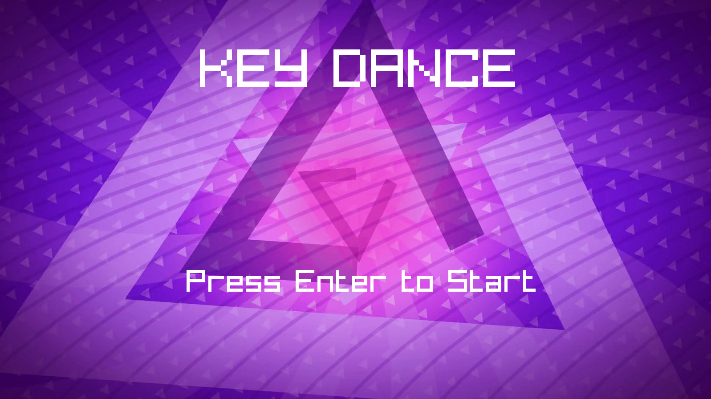
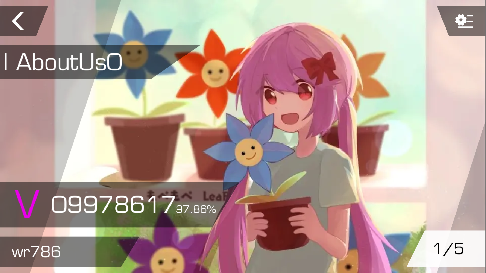
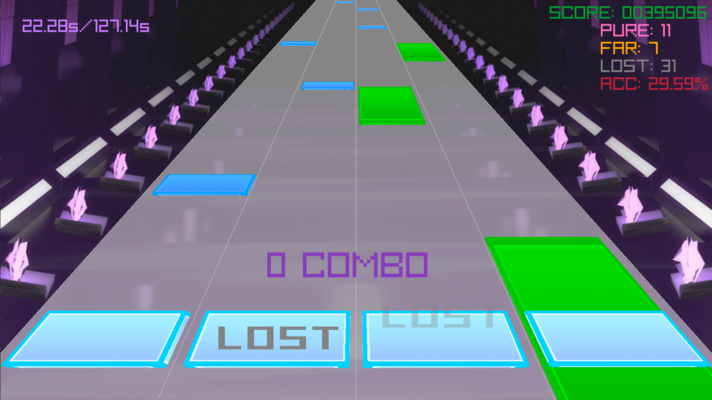
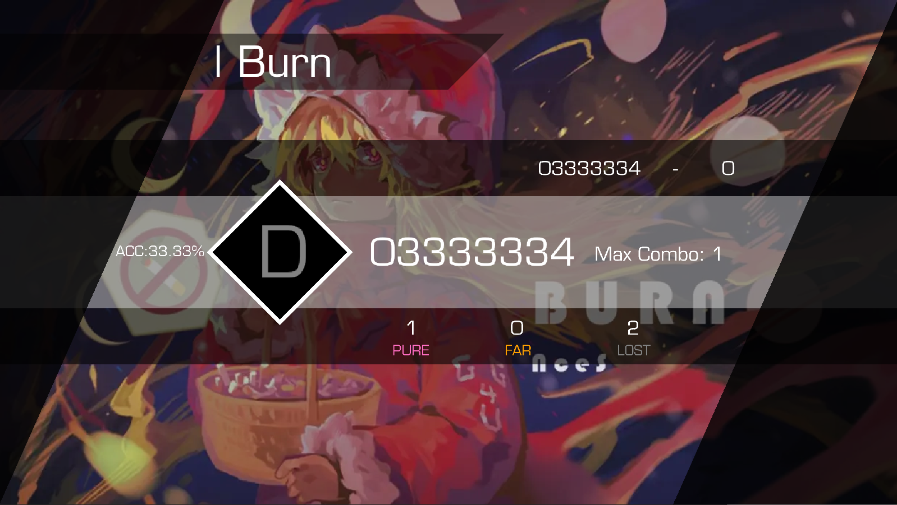

# Key Dance 

### 游戏简介

Key Dance 是一款音乐游戏，配合炫酷的音乐和敲击键盘，与节奏吻合即可得分！

在传统游玩模式的基础上，我们引入了创作者模式。玩家可以根据音乐节奏自主创作按键组合，并把结果保存，以供游玩模式使用。

### 玩法说明
- 欢迎界面：打开游戏来到欢迎界面，按下`ENTER`进入游戏

- 选择界面：接下来选择游戏模式（游玩模式/创作者模式）和音乐。按键`←`和`→`切换模式，按键`↑`和`↓`切换音乐。打开音响，您可以预览音乐。

- 游戏界面：游戏界面中共有四条轨道，从左至右分别对应按键`D` `F` `J` `K`。按下`ENTER`暂定/继续游戏，按下`Q`返回到音乐选择界面。
   - 在游玩模式中，当方块飘移至屏幕前方的浅蓝色方块时，快速按下对应按键！蓝色方块为短节奏，只需敲击一次；绿色方块为长节奏，若想获得更高分数，按键持续时长需要与方块长度匹配。
   - 在创作者模式中，根据音乐创作独属于你的节奏！瞬间敲击识别为短节奏，持续按键识别为长节奏。
   

- 得分界面：游戏结束后，系统将根据敲击节奏与音乐的吻合度进行打分。按下`Q`再来一局，按下`ESC`退出游戏。

